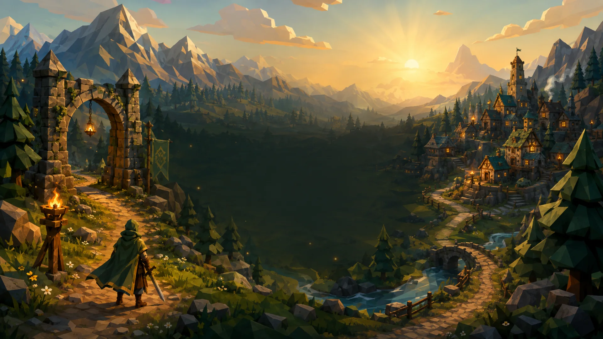

# Arkadii Quest / Аркадия Квест

An old-school fantasy adventure in your browser. Explore Arkadia, complete
quests, develop your hero, and meet other players in a persistent 3D world.

Олдскульное фэнтези-приключение в браузере: исследуйте Аркадию, выполняйте
задания и развивайте своего героя в общем мире.



Arkadii Quest is a multiplayer top-down RPG built with Babylon.js, Colyseus,
Express, TypeScript, and SQL persistence. The repository contains the browser
client and game server together with local containers, observability, automated
quality checks, and the public deployment profile for
[`https://arkadii.world/game/`](https://arkadii.world/game/).

The visual direction draws on the clarity and atmosphere of classic browser
RPGs: forest green, aged bronze, parchment, readable silhouettes, and a compact
adventure-focused interface. All Arkadii Quest branding is original; the
project is not affiliated with or endorsed by RuneScape or Jagex.

## Project at a Glance

| Area | Stack | Notes |
| --- | --- | --- |
| Client | Babylon.js, TypeScript, Webpack | 3D world, bilingual content, responsive UI, controls, assets, and networking |
| Server | Node.js, Express, Colyseus | REST API, real-time rooms, static delivery, health checks, and metrics |
| Data | MySQL, SQLite fallback | Docker uses MySQL; host development can use SQLite |
| Infrastructure | Docker Compose, nginx, Caddy, Prometheus, Grafana | Local HTTPS stack and public deployment profile |

## Current Gameplay

- Explore the fantasy world of Arkadia (`Аркадия` in Russian).
- Create a character or use Quick Play and enter a shared multiplayer world.
- Fight with four starter abilities: sword attack, fireball,
  damage-over-time, and healing.
- Complete quests, talk to trainers and vendors, trade, collect loot, equip
  items, gain experience, and spend ability points.
- Travel between the starting settlement, training area, and dungeon-style
  locations with navmesh collision and persistent character data.
- Encounter enemies with `IDLE`, `PATROL`, `CHASE`, `ATTACK`, and `DEAD` states.
- Use global chat, targeting, item pickup, inventory, quests, abilities,
  character/equipment, and help panels.
- Play in English or Russian with localized interface, active game data,
  dialogs, entity names, help, metadata, accessibility text, and supported
  server notifications.
- Play with keyboard or touch controls on responsive desktop, portrait, and
  short-landscape layouts.

## Controls and Onboarding

The first entry into the world presents a localized onboarding guide. It
introduces movement, interaction, targeting, combat slots, chat, and the main
panels without requiring the player to discover controls by trial and error.
On desktop, press `F1` at any time to reopen the controls guide. Touch players
can use the persistent guide button.

The camera follows the active character automatically and keeps the action
framed. Mouse-wheel zoom and mouse-drag rotation are intentionally not gameplay
controls.

| Keyboard input | Action |
| --- | --- |
| `W`, `A`, `S`, `D` or arrow keys | Move relative to the automatic camera |
| `1`–`9` | Use the corresponding hotbar slot |
| `E` | Interact with the nearest available character or object |
| `Tab` | Select the nearest valid target |
| `Enter` | Focus or submit chat |
| `I` | Open inventory |
| `J` | Open quests |
| `K` | Open abilities |
| `C` | Open character and equipment |
| `H` | Open help |
| `F1` | Show the onboarding and controls guide |
| `Escape` | Close the active panel or guide |
| `Home` | Capture a screenshot through the game action |

Touch mode provides a virtual joystick, tappable hotbar, contextual interact,
target and chat actions, and a compact main menu. The same automatic camera
follows the character; no world-swipe rotation is required.

## Web Quality

- Accessible pre-game language/control selection and labelled login controls
  with keyboard focus, validation, and live status.
- Semantic HTML shell with language, main and heading landmarks, skip
  navigation, canvas instructions, reduced-motion behavior, and screen-reader
  announcements.
- Canonical metadata, Open Graph/Twitter cards, `VideoGame` JSON-LD, a web app
  manifest, and crawler/answer-engine discovery files.
- Runtime asset deduplication, mobile render scaling, reduced mobile shadow
  cost, compression, and an explicit cache policy.
- Automated localization/data checks and real WebGL Playwright flows for
  desktop and touch gameplay.
- `scrypt` password hashing with automatic migration of valid legacy plaintext
  credentials; authentication responses never include password data.

The latest recorded pre-rebrand Lighthouse result is **80 Performance / 100
Accessibility / 100 Best Practices / 100 SEO**. It is a historical baseline,
not a fresh production measurement for the current brand assets. See the
[Game Quality Audit](docs/GAME_QUALITY_AUDIT.md) for the test matrix and open
risks.

## Requirements

- Node.js 22, matching [`.nvmrc`](.nvmrc).
- npm, installed with Node.js.
- Docker with Docker Compose support for the containerized stack.
- `openssl` and `sudo` for the local HTTPS domain setup script.
- Chromium for browser E2E tests; install it with
  `npx playwright install chromium` when no compatible browser is available.

Install dependencies once:

```bash
npm install
```

## Quick Start with Docker

```bash
cp .env.example .env
scripts/setup-local-domain.sh
docker compose up -d --build
```

| Surface | URL |
| --- | --- |
| Game | `https://arkadii.game.local` |
| Docs | `https://arkadii.game.local/docs` |
| Grafana | `https://grafana.arkadii.game.local` |
| Prometheus | `https://prometheus.arkadii.game.local` |

Only nginx publishes a host port: `127.0.0.1:${HTTPS_PORT:-443}:443`. The game
server, MySQL, Prometheus, and Grafana remain private inside the Docker network.

## Local Development without Docker

Start the server and Webpack client in separate terminals:

```bash
APP_DATABASE=sqllite npm run server-dev
```

```bash
npm run client-dev
```

`sqllite` is the existing configuration spelling used by the fallback adapter.
The Webpack client opens the game scene directly; the built client served on
port `3000` starts with the production entry flow.

| Surface | URL |
| --- | --- |
| Client dev server | `http://localhost:8080` |
| API and game server | `http://localhost:3000` |
| Colyseus monitor | `http://localhost:3000/monitor` |

## Useful Commands

| Command | Purpose |
| --- | --- |
| `npm run client-build` | Build the production browser bundle into `dist/client` |
| `npm run server-build` | Compile the TypeScript server and copy public assets |
| `npm run check:localization` | Validate English/Russian catalogs, placeholders, content, dialogs, and bindings |
| `npm run check:web-quality` | Validate metadata, structured data, manifest, crawler files, and local references |
| `npm run test:e2e` | Run real WebGL desktop and mobile-touch Playwright projects |
| `npx tsc --noEmit` | Type-check the complete source tree without writing output |
| `npm audit --omit=dev` | Review vulnerabilities in production dependencies |
| `docker compose config` | Validate the local Compose configuration |
| `docker compose up -d --build` | Build and run the complete local stack |
| `npm run smoke:ws` | Join the default Colyseus room through local HTTPS/WSS |
| `npm run loadtest` | Run the interactive Colyseus chat load test |
| `npm run check:public` | Check DNS and host readiness for the public deployment |

## Public Deployment

The public profile serves Arkadii Quest at
[`https://arkadii.world/game/`](https://arkadii.world/game/) through Caddy with
automatic Let's Encrypt certificates.

```bash
cp .env.public.example .env.public
npm run check:public
docker compose --env-file .env.public -f docker-compose.public.yml up -d --build
```

Replace every `CHANGE_ME` value in `.env.public` before starting the public
stack. Caddy publishes only ports `80` and `443`; MySQL, Prometheus, and Grafana
remain private inside Docker.

| Endpoint | Purpose |
| --- | --- |
| `https://arkadii.world/robots.txt` | Crawler policy and sitemap location |
| `https://arkadii.world/sitemap.xml` | Canonical game and documentation URLs |
| `https://arkadii.world/llms.txt` | Concise answer-engine project description |
| `https://arkadii.world/game/manifest.webmanifest` | Browser app metadata |

## Legacy Compatibility Identifiers

The public product name is Arkadii Quest, but several internal identifiers still
use the `t5c` prefix. Database names/users, Docker Compose project and volume
names, and Prometheus metric names are temporarily kept unchanged so an in-place
rebrand cannot disconnect existing data or dashboards. Browser preferences and
tokens now use `arkadii_quest_*`; the former `t5c_*` browser keys are read once
as migration aliases and then removed. Treat the remaining legacy names as
implementation details; do not rename them without a coordinated backup, data
migration, and metrics transition. Exact values are documented in the
deployment guides.

## Documentation

| Document | What it covers |
| --- | --- |
| [Documentation Index](docs/README.md) | Runtime URL map and guide index |
| [Project Overview](docs/PROJECT.md) | Architecture, runtime shape, persistence, and scripts |
| [Localization and Controls](docs/LOCALIZATION_AND_CONTROLS.md) | Language flow, onboarding, automatic camera, keyboard/touch controls, and QA |
| [API and Security](docs/API_AND_SECURITY.md) | REST endpoints, authentication, delivery policy, and security boundaries |
| [Game Quality Audit](docs/GAME_QUALITY_AUDIT.md) | UX, accessibility, assets, performance, and remaining risks |
| [Infrastructure and Deployment](docs/INFRASTRUCTURE_AND_DEPLOYMENT.md) | Local Docker stack, TLS, observability, and troubleshooting |
| [Public Deployment](docs/PUBLIC_DEPLOYMENT.md) | DNS, Caddy, secrets, startup, and production checks |
| [Third-Party Assets](THIRD_PARTY_ASSETS.md) | Known asset sources, license obligations, and unresolved provenance |

## License and Attribution

The codebase remains available under the repository's [MIT License](LICENSE).
Arkadii Quest preserves the copyright and license notice of the upstream work;
the rebrand does not claim authorship of that original code. See [NOTICE](NOTICE.md)
for provenance and [Third-Party Assets](THIRD_PARTY_ASSETS.md) before
redistributing or commercializing any asset bundle.
